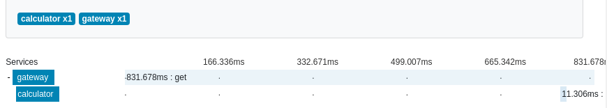
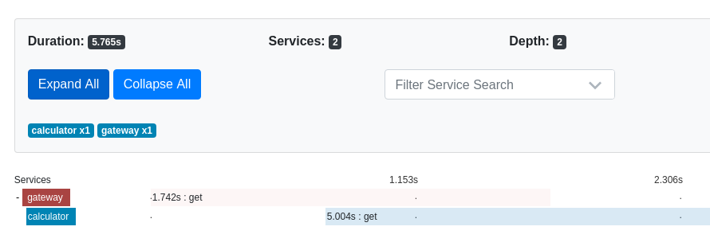
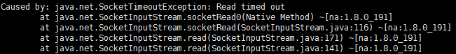
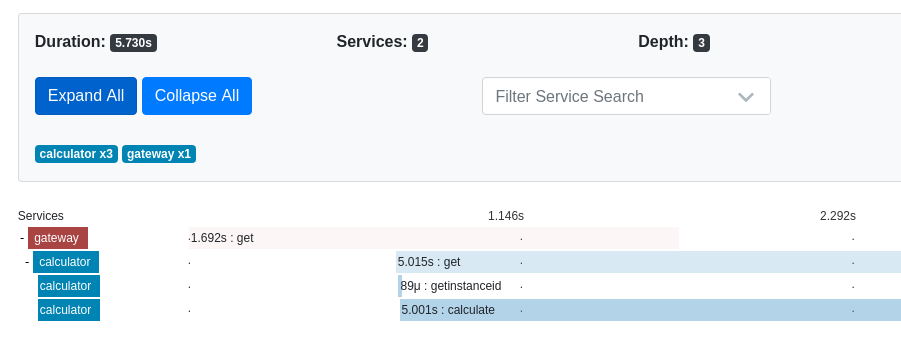
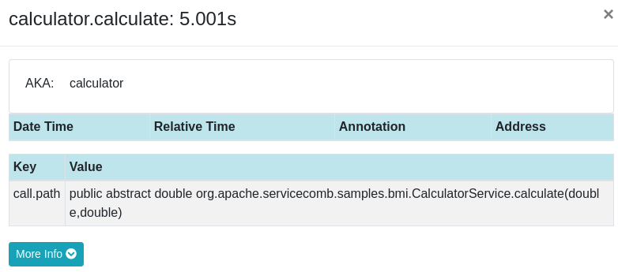

# 自定义追踪功能
ServiceComb 支持用户在程序中的指定位置处增加追踪数据，可以实现更细力度的追踪。
## 使用步骤
添加依赖
```xml
    <dependency>
      <groupId>org.apache.servicecomb</groupId>
      <artifactId>tracing-zipkin</artifactId>
    </dependency>
```
在程序入口或者配置处添加 `@EnableZipkinTracing` 注解
```java
import org.apache.servicecomb.tracing.zipkin.EnableZipkinTracing;

@SpringBootApplication
@EnableServiceComb
@EnableZipkinTracing
public class CalculatorApplication {

  public static void main(String[] args) {
    SpringApplication.run(CalculatorApplication.class, args);
  }
}
```

在服务程序中的调用方法处添加 `@Span` 注解
```java
import org.apache.servicecomb.tracing.Span;

@Service
public class CalculatorServiceImpl implements CalculatorService {

  /**
   * {@inheritDoc}
   */
  @Span
  @Override
  public double calculate(double height, double weight) {
    if (height <= 0 || weight <= 0) {
      throw new IllegalArgumentException("Arguments must be above 0");
    }
    double heightInMeter = height / 100;
    double bmi = weight / (heightInMeter * heightInMeter);
    return roundToOnePrecision(bmi);
  }

  private double roundToOnePrecision(double value) {
    return new BigDecimal(value).setScale(1, RoundingMode.HALF_UP).doubleValue();
  }
}
```
使用限制：自定义跟踪仅支持注解请求线程中的方法调用，且带有`@Span`的类必须是spring管理的bean。
## 快速演示
下面使用java-chassis/samples/bmi 程序演示，如何使用自定义追踪功能定位应用程序中的问题？
1. 正常运行bmi程序，结果如下
    
	
2. 在bmi程序的calculator服务的calculate方法处，增加一块进程休眠代码（模拟实际工作中调用当前线程处理其他业务的情景），如下
	```java
	public double calculate(double height, double weight) {

	    try{
	    Thread.currentThread().sleep(5000);
	    } catch (Exception e){

	    }

	    if (height <= 0 || weight <= 0) {
	      throw new IllegalArgumentException("Arguments must be above 0");
	    }
	    double heightInMeter = height / 100;
	    double bmi = weight / (heightInMeter * heightInMeter);
	    return roundToOnePrecision(bmi);
	  }

	```
3. 运行bmi程序，出现如下异常结果。查看zipkin追踪情况和程序报错信息，可以初步确定问题由 bmi/calculator 服务超时未响应导致
         	
    
    
4. 使用自定义追踪功能，定位问题具体位置
	在calculator服务中配置自定义追踪功能，添加注解 `@Span`在calculator服务的方法上 。运行bmi程序，zipkin追踪耗时情况如下。根据span占用的时间戳，可以确定延时问题出现在calculate方法处，点击span，可查看call.path 获取calculate方法的具体位置。
	
	
## 总结
从上面的示例可以看出，通过配置ServiceComb的自定义追踪功能，可以实现对服务中调用方法、接口的追踪，实现更细力度化的追踪。这对于我们监控服务内部调用、定位服务中的延时问题等非常有帮助。
